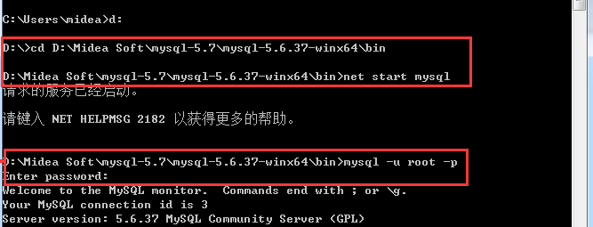

cd D:\Midea Soft\mysql-5.7\mysql-5.6.37-winx64\bin

net start mysql

mysql -u root -p

show databases;

use cloud_note;

show tables;

source命令导入sql文件

source E:/mysql/cn_notebook.sql;

desc cn_notebook;

drop table cn_notebook;

CREATE TABLE cn_notebook (
	cn_notebook_id VARCHAR(100) PRIMARY KEY,
	cn_user_id VARCHAR(100)  NULL ,
	cn_notebook_type_id VARCHAR(10) NULL ,
	cn_notebook_name VARCHAR(500) NULL ,
	cn_notebook_desc TEXT not null,
	cn_notebook_createtime  timestamp NOT NULL DEFAULT CURRENT_TIMESTAMP ON UPDATE CURRENT_TIMESTAMP
);

